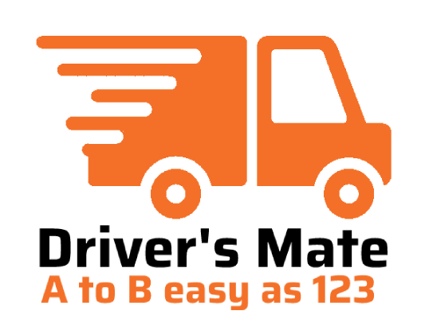

# Driver's Mate :truck: :articulated_lorry: :pickup_truck: :package:
## A mobile and tablet web app for drivers to manage their trips.


View the project on [Netlify](https://main--resonant-snickerdoodle-275007.netlify.app/)

Or follow instructions to run in a dev or production environment:

## Project setup

Clone the repo and install dependencies

```
https://github.com/krisjwood/drivers-mate-vue.git && npm i
```

### Run locally - compiles and hot-reloads for development
```
npm run serve
```

### Compiles and minifies for production
```
npm run build
```
Choose your preferred hosting provider e.g. [AWS Amplify](https://aws.amazon.com/amplify/), [Heroku](https://www.heroku.com/)
### Run unit tests
```
npm run test
```

### Lints and fixes files
```
npm run lint
```
